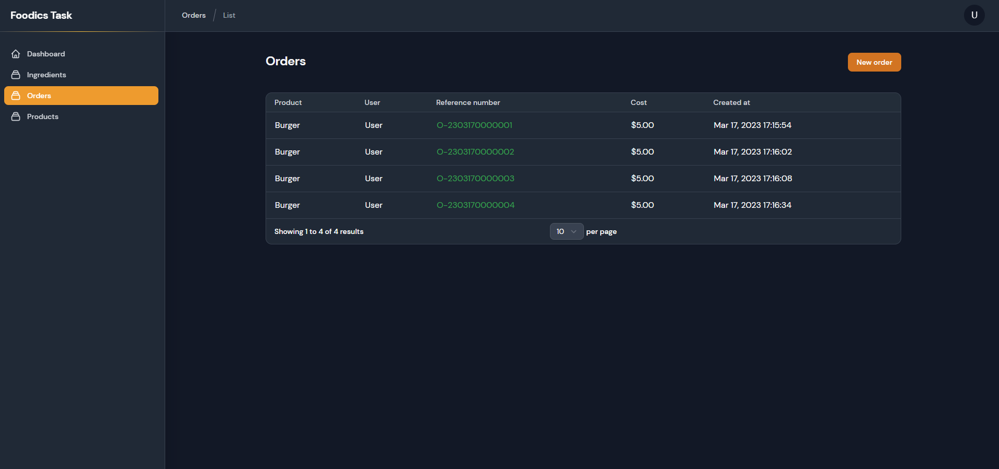

<h1 align="center">Restaurants Stock Orders</h1>

<!-- TABLE OF CONTENTS -->
<details open="open">
  <summary><h2 style="display: inline-block">Table of Contents</h2></summary>
  <ol>
    <li>
      <a href="#about-the-project">About The Project</a>
      <ul>
        <li><a href="#built-with">Built With</a></li>
      </ul>
    </li>
    <li>
      <a href="#getting-started">Getting Started</a>
      <ul>
        <li><a href="#prerequisites">Prerequisites</a></li>
        <li><a href="#installation">Installation</a></li>
      </ul>
    </li>
    <li><a href="#usage">Usage</a></li>
    <li><a href="#digram">Database Digram</a></li>
    <li><a href="#testing">Testing</a></li>
    <li><a href="#images">Images</a></li>
    <li><a href="#contributing">Contributing</a></li>
    <li><a href="#license">License</a></li>
  </ol>
</details>

<!-- ABOUT THE PROJECT -->

## About The Project


### Built With

-   Laravel V10.3.3
-   Filament V2.17.16
-   Bootstrap V5.3.0-alpha

<!-- GETTING STARTED -->

## Getting Started

To get a local copy up and running follow these simple steps.

### Prerequisites

This is an example of how to list things you need to Prepare.

-   Local Server Or Live Server
-   PHP Version 8.1+
-   `Composer` [Download From Here](https://getcomposer.org/download)
-   Command Line and I prefer `Git Bash` You Can download it [From Here](https://git-scm.com/downloads)

<hr>

### Installation

-   Clone the repo
    ```sh
    git clone https://github.com/EGYWEB-Mohamed/foodics_task.git
    ```
-   Install Required packages With `composer`
    ```sh
    composer install
    ```
-   Copy .env.example file and rename it with .env
    ```sh
      cp .env.example .env
    ```
-   Generate Key
    ```ssh
    php artisan key:generate
    ```
-   Create Two Database

    -   Testing `DB_TEST_DATABASE`
    -   Live `DB_DATABASE`

-   Fill `.env` File With Important Data

    ```sh
    DB_DATABASE=
    DB_TEST_DATABASE=
    DB_USERNAME=
    DB_PASSWORD=
    ....
    MAIL_HOST=
    MAIL_PORT=587
    MAIL_USERNAME=
    MAIL_PASSWORD=
    .....
    MERCHANT_MAIL="merchant@test.com"
    LOWEST_STOCK_PERCENTAGE=50
    ```

    And Don't Forget To Fill SMTP Data To Recive a notification Whenever Any Stock Is Low `You can also specify when you will receive an alert when a certain percentage is reached with LOWEST_STOCK_PERCENTAGE 😉`

-   Then Run To Migrate All Database Also to seed with dummy data
    ```ssh
    php artisan migration --seed
    ```
    -   Account Credential
        ```
        Email : admin@test.com
        Password :  123456
        ```
- If your using local server don't forget to run `php artisan serv` or you can navigate from localhost correct installation path

- Don't Forget To run queue worker so it's important to deliver the Email Notification 
    ```ssh
  php artisan queue:work
  ```

-   Want To Test The Whole Application and functionality ? <a href="#testing">Easy Jump To This Part</a>

<hr>

<!-- USAGE EXAMPLES -->

## Usage
In a system that has three main models; Product, Ingredient, and Order.
A Burger (Product) may have several ingredients:
- 150g Beef
- 30g Cheese
- 20g Onion

The system keeps the stock of each of these ingredients stored in the database. You
can use the following levels for seeding the database:
- 20kg Beef
- 5kg Cheese
- 1kg Onion

When a customer makes an order that includes a Burger. The system needs to update the
stock of each of the ingredients so it reflects the amounts consumed.
Also when any of the ingredients stock level reaches 50%, the system should send an
email message to alert the merchant they need to buy more of this ingredient.

<!-- USAGE EXAMPLES -->
<hr>

## Digram


<hr>

## Images





<hr>

## Testing
When You Finish Setup the application you can easily run
  ```ssh
  php artisan test
  ```
  
You Got Green Pass So What you are waiting for 😂

<br>

 #### Test Cases Coverage:
✔️ Is Home Page Work ? <br>
✔️ Is Home Page Has Products ?<br>
✔️ Is There Auth Links ?<br>
✔️ Is Auth Required To Buy New Product ?<br>
✔️ Is User Can Login Successfully ?<br>
✔️ Is there Logout and Dashboard Link ?<br>
✔️ Is Dashboard Work ?<br>
✔️ Is Orders Page Work ?<br>
✔️ Is Products Page Work ?<br>
✔️ Is Ingredients Page Work ?<br>
✔️ Is There Burger Product With its Ingredients Exists?<br>
️✔️ Is Buy Button Work ?<br>
✔️ Is Product Ingredients Stock 100% ?<br>
✔️ Is Order Added To DB ?<br>
✔️ Is Product Ingredients Decreased ?<br>
✔️ Is Ingredients Decreased Is Correct ?<br>

 <b>14 Test Case With 34 assertions</b>

## Contributing

Contributions are what make the open source community such an amazing place to be learn, inspire, and create. Any contributions you make are **greatly appreciated**.

1. Fork the Project
2. Create your Feature Branch (`git checkout -b feature/AmazingFeature`)
3. Commit your Changes (`git commit -m 'Add some AmazingFeature'`)
4. Push to the Branch (`git push origin feature/AmazingFeature`)
5. Open a Pull Request

<!-- LICENSE -->

## License

Distributed under the MIT License. See `LICENSE` for more information.
